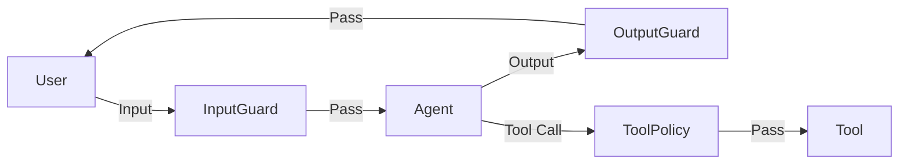

# Guardrails — Input/Output Safety & Tool Permissions

> 为 ChainForge Agent 添加输入/输出安全护栏和工具权限控制

## Motivation

Agent 越强大，越需要安全控制。特别是加入代码沙箱后，Agent 可能尝试执行危险命令、泄露敏感信息、或被注入攻击劫持。

ChainForge 需要一套轻量但实用的 guardrail 系统。

---

## Design

### Architecture



### Guard Types

| Guard | Phase | Purpose |
|-------|-------|---------|
| `InjectionDetector` | Input | 检测提示注入和越狱 |
| `TopicFilter` | Input | 限制话题范围 |
| `SensitiveDataFilter` | Input | 检测输入中的 PII |
| `PIILeakGuard` | Output | 防止输出泄露敏感信息 |
| `ContentSafetyGuard` | Output | 检测有害内容 |
| `QualityGuard` | Output | 基本的输出质量检查 |
| `ToolPermissionPolicy` | Tool | 工具调用权限控制 |

### Results

| Action | Meaning |
|--------|---------|
| `block` | 拒绝请求，返回错误 |
| `flag` | 允许但记录警告 |
| `rewrite` | 安全改写内容 |
| `warn` | 只记录日志 |

### Middleware Integration

Guardrails 通过现有 Middleware 链集成：

```python
from chainforge.guardrails.input import InjectionDetector
from chainforge.guardrails.output import PIILeakGuard
from chainforge.guardrails.middleware import GuardrailMiddleware

agent = Agent(
    llm=llm,
    middlewares=[
        GuardrailMiddleware(guardrails=[
            ("input", InjectionDetector()),
            ("output", PIILeakGuard()),
        ]),
    ],
)
```

## Files

| File | Description |
|------|-------------|
| `chainforge/guardrails/__init__.py` | Exports |
| `chainforge/guardrails/base.py` | GuardrailResult, GuardrailAction, result helpers |
| `chainforge/guardrails/input.py` | InjectionDetector, TopicFilter, SensitiveDataFilter |
| `chainforge/guardrails/output.py` | PIILeakGuard, ContentSafetyGuard, QualityGuard |
| `chainforge/guardrails/tool_permissions.py` | ToolPermissionPolicy |
| `chainforge/guardrails/middleware.py` | GuardrailMiddleware |
| `tests/test_guardrails.py` | Tests |
